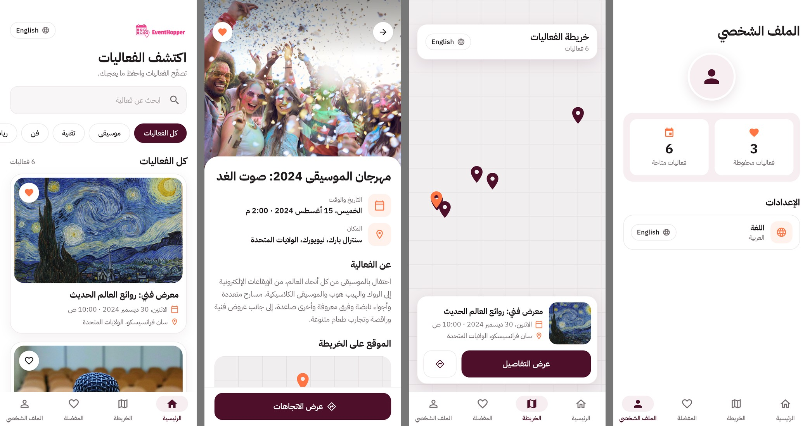
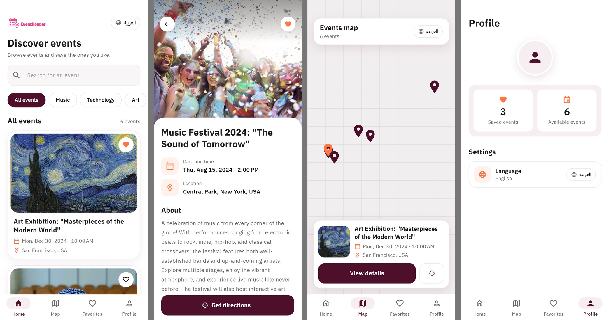

# Event Hopper — Events Discovery App

A responsive **Flutter** app for browsing events, viewing them on a map, and saving favorites.

## Features

- 📅 **Events list** — large photo cards, search by title, and category chips that filter by words in the event title
- 🎟️ **Event details** — photo, date and time, location, description, a small map preview and a "Get directions" button that opens Google Maps (`url_launcher`)
- 🗺️ **Map view** — every event as a pin on Google Maps (`google_maps_flutter`), with a card for the selected event
- ⭐ **Favorites** — tap the heart to save an event; saved locally with **Hive**
- 👤 **Profile** — saved-events count and the language setting
- 🌍 **Arabic (RTL) and English** (`easy_localization`) — Arabic by default, switchable from the main screens
- 🖥️ Desktop-aware — navigation rail instead of the bottom bar (the map itself runs on Android and iOS only)

The events are six demo events seeded into Hive on first launch; there is no backend.

## Screenshots

| Arabic | English |
|---|---|
|  |  |

Rendered from the real screens with sample data by `tool/screens_golden_test.dart`.
The Google map cannot render off-screen, so the test draws a plain grid with the event pins in its place. The English sheet shows the demo events the app seeds; the Arabic sheet shows the same six events translated.

## Stack

**Provider** + **get_it**, Hive persistence, feature screens under a main shell, one shared theme.

```
lib/
├── models/      # event model (+ Hive adapter)
├── Adapters/    # custom LatLng Hive adapter
├── providers/   # event and favorites state
├── services/    # Hive storage, navigation
├── themes/      # colors and ThemeData
├── widgets/     # event card, map, shared widgets
└── screens/     # home, map, details, favorites, profile, splash
assets/translations/   # ar.json, en.json
```

## Getting Started

```bash
flutter pub get
flutter run
```

The map needs a Google Maps API key. Replace `YOUR_GOOGLE_MAPS_API_KEY` in
`android/app/src/main/AndroidManifest.xml` and `ios/Runner/AppDelegate.swift`;
until then the map area stays blank.

To re-render the screenshots:

```bash
flutter test --update-goldens tool/screens_golden_test.dart
```

## 📦 Packages

| Package | Version |
|---|---|
| `provider` | ^6.1.2 |
| `get_it` | ^8.0.2 |
| `hive_flutter` | ^1.1.0 |
| `window_manager` | ^0.4.3 |
| `path_provider` | ^2.1.5 |
| `intl` | ^0.20.1 |
| `google_maps_flutter` | ^2.10.0 |
| `location` | ^7.0.1 |
| `geolocator` | ^13.0.2 |
| `url_launcher` | ^6.3.1 |
| `logger` | ^1.0.0 |
| `shared_preferences` | ^2.3.4 |
| `easy_localization` | ^3.0.8 |
| `cupertino_icons` | ^1.0.8 |

